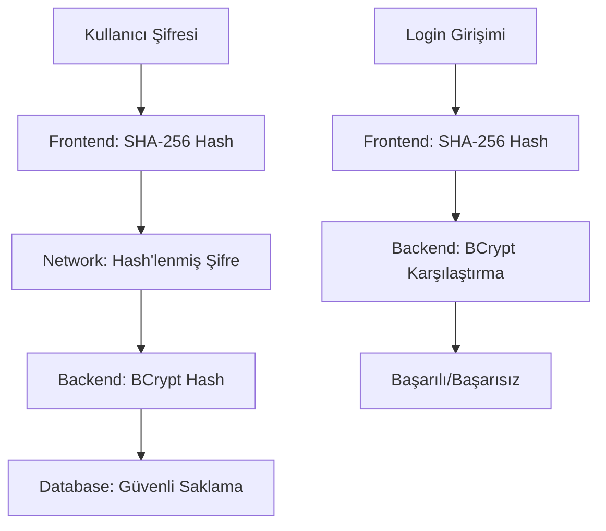

# 🔐 Güvenlik Implementasyonu
### SHA-256 + BCrypt Çift Katmanlı Şifre Güvenliği

[](#)
[](#)
[](#)

Bu proje, kullanıcı şifrelerini güvenli şekilde işlemek için **SHA-256 + BCrypt** kombinasyonu kullanır.

---

## 🏗️ Güvenlik Mimarisi

### 🌐 Frontend (React)
```javascript
// Kullanıcı şifresi → SHA-256 Hash → Network'e gönderim
const hashedPassword = await hashPassword(userPassword);
```
- ✅ Kullanıcı şifresini **SHA-256** ile hash'ler
- ✅ Network'te sadece hash'lenmiş şifre gönderilir
- ✅ Plain text şifre hiçbir zaman network'te görünmez

### ⚙️ Backend (Spring Boot)
```java
// SHA-256 Hash → BCrypt Hash → Database'e kayıt
String encodedPassword = passwordEncoder.encode(hashedPassword);
```
- ✅ Gelen **SHA-256 hash'ini** "parola" olarak kabul eder
- ✅ Register: SHA-256 hash'ini **BCrypt** ile tekrar hash'ler
- ✅ Login: SHA-256 hash'ini DB'deki BCrypt hash ile karşılaştırır
- ✅ Veritabanında sadece **BCrypt hash** saklanır

---

## 📁 Dosya Yapısı

### Frontend
```
frontend/src/
├── 📁 utils/
│   └── 📄 passwordUtils.js          # SHA-256 hashleme ve güçlülük kontrolü
├── 📁 components/
│   ├── 📄 Login.jsx                 # Giriş bileşeni (SHA-256)
│   └── 📄 Register.jsx              # Kayıt bileşeni (SHA-256 + güçlülük)
└── 📁 services/
    └── 📄 api.ts                    # API servisleri
```

### Backend
```
backend/src/main/java/com/bahattintok/e_commerce/
├── 📁 service/impl/
│   └── 📄 AuthServiceImpl.java      # Auth servis (SHA-256 + BCrypt)
└── 📁 dto/
    ├── 📄 SignInRequest.java        # Giriş DTO
    └── 📄 SignUpRequest.java        # Kayıt DTO
```

---

## 🚀 Kullanım Örnekleri

### Frontend - Şifre Hashleme
```javascript
import { hashPassword } from '../../utils/passwordUtils';

// Şifreyi hash'le
const hashedPassword = await hashPassword('userPassword123');

// API'ye gönder
const response = await api.post('/auth/signin', {
  email: 'user@example.com',
  password: hashedPassword // SHA-256 hash
});
```

### Backend - Şifre İşleme
```java
@Service
public class AuthServiceImpl {
    
    // Register işleminde
    public User register(SignUpRequest request) {
        String hashedPassword = request.getPassword(); // SHA-256 hash
        String encodedPassword = passwordEncoder.encode(hashedPassword); // BCrypt
        user.setPassword(encodedPassword);
        return userRepository.save(user);
    }
    
    // Login işleminde
    public boolean authenticate(SignInRequest request) {
        String hashedPassword = request.getPassword(); // SHA-256 hash
        return passwordEncoder.matches(hashedPassword, user.getPassword()); // BCrypt karşılaştırma
    }
}
```

---

## 🛡️ Güvenlik Avantajları

| Katman | Teknoloji | Avantaj |
|--------|-----------|---------|
| 🌐 **Network** | SHA-256 | Plain text şifre hiçbir zaman iletilmez |
| 💾 **Database** | BCrypt | Güvenli hash saklama + otomatik salt |
| 🔄 **Çift Katman** | SHA-256 + BCrypt | İki aşamalı şifreleme koruması |
| ⚡ **Performance** | Client-side hash | Server yükünü azaltır |
| 🔍 **Güçlülük** | Real-time check | Anlık şifre güçlülük analizi |

---

## 📊 Şifre Güçlülük Sistemi

### Güçlülük Seviyeleri
```javascript
const strengthLevels = {
  0: { label: 'Çok Zayıf', color: 'red-500', icon: '❌' },
  1: { label: 'Zayıf', color: 'orange-400', icon: '⚠️' },
  2: { label: 'Orta', color: 'yellow-500', icon: '🔶' },
  3: { label: 'Güçlü', color: 'blue-500', icon: '🔷' },
  4: { label: 'Çok Güçlü', color: 'green-500', icon: '✅' }
};
```

### Değerlendirme Kriterleri
- ✅ **Uzunluk**: En az 8 karakter
- ✅ **Büyük Harf**: A-Z karakterleri
- ✅ **Küçük Harf**: a-z karakterleri
- ✅ **Rakam**: 0-9 sayıları
- ✅ **Özel Karakter**: !@#$%^&* vb.

---

## ⚙️ Konfigürasyon

### BCrypt Konfigürasyonu
```java
@Configuration
public class SecurityConfig {
    
    @Bean
    public PasswordEncoder passwordEncoder() {
        return new BCryptPasswordEncoder(12); // Güçlü hash seviyesi
    }
}
```

### Frontend Hashleme Utility
```javascript
// SHA-256 hashleme (Web Crypto API)
export const hashPassword = async (password) => {
  const encoder = new TextEncoder();
  const data = encoder.encode(password);
  const hashBuffer = await crypto.subtle.digest('SHA-256', data);
  const hashArray = Array.from(new Uint8Array(hashBuffer));
  return hashArray.map(b => b.toString(16).padStart(2, '0')).join('');
};

// Şifre güçlülük kontrolü
export const checkPasswordStrength = (password) => {
  let score = 0;
  
  if (password.length >= 8) score++;
  if (/[A-Z]/.test(password)) score++;
  if (/[a-z]/.test(password)) score++;
  if (/[0-9]/.test(password)) score++;
  if (/[^A-Za-z0-9]/.test(password)) score++;
  
  return score;
};
```

---

## 🧪 Test Senaryoları

### Frontend Testleri
```javascript
describe('Password Utils', () => {
  test('should hash password correctly', async () => {
    const password = 'testPassword123';
    const hash = await hashPassword(password);
    expect(hash).toHaveLength(64); // SHA-256 = 64 hex chars
  });
  
  test('should calculate strength correctly', () => {
    expect(checkPasswordStrength('weak')).toBe(1);
    expect(checkPasswordStrength('StrongPass123!')).toBe(5);
  });
});
```

### Backend Testleri
```java
@Test
public void testPasswordEncoding() {
    String hashedPassword = "hashed_sha256_password";
    String encoded = passwordEncoder.encode(hashedPassword);
    
    assertTrue(passwordEncoder.matches(hashedPassword, encoded));
    assertFalse(passwordEncoder.matches("wrong_password", encoded));
}
```

---

## ⚠️ Güvenlik Uyarıları

### 🔒 Üretim Ortamı
- ✅ **HTTPS Kullanın**: Production'da mutlaka HTTPS
- ✅ **Güvenli Cookie**: JWT token'ları HttpOnly cookie'lerde
- ✅ **Rate Limiting**: Brute force saldırılarına karşı koruma
- ✅ **CORS Ayarları**: Güvenli cross-origin konfigürasyonu

### 📝 Geliştirme Notları
- ❌ **Log Güvenliği**: Şifre hash'lerini log'lamayın
- ❌ **Debug Bilgileri**: Production'da debug modunu kapatın
- ❌ **Hardcoded Secrets**: Gizli anahtarları kodda saklamayın
- ❌ **Weak Salts**: BCrypt otomatik salt kullanır, manuel salt eklemeyin

---

## 🔄 Güvenlik Akışı



---

## 📈 Performans Metrikleri

| İşlem | Süre | Açıklama |
|-------|------|----------|
| SHA-256 Hash | ~1ms | Client-side, hızlı |
| BCrypt Hash | ~100ms | Server-side, güvenli |
| BCrypt Verify | ~100ms | Login doğrulama |
| Total Login | ~200ms | Toplam süre |

---

## 🎯 Sonuç

Bu güvenlik implementasyonu ile:

- ✅ **Network Güvenliği**: Plain text şifre hiçbir zaman iletilmez
- ✅ **Database Güvenliği**: Güvenli BCrypt hash saklama
- ✅ **Çift Koruma**: SHA-256 + BCrypt kombinasyonu
- ✅ **Kullanıcı Deneyimi**: Gerçek zamanlı şifre güçlülük kontrolü
- ✅ **Performans**: Client-side hash ile server yükü azaltma

---

<div align="center">

### 🔐 Güvenli Kodlama İçin Bu İmplementasyonu Kullanın!

[](#)

</div>
